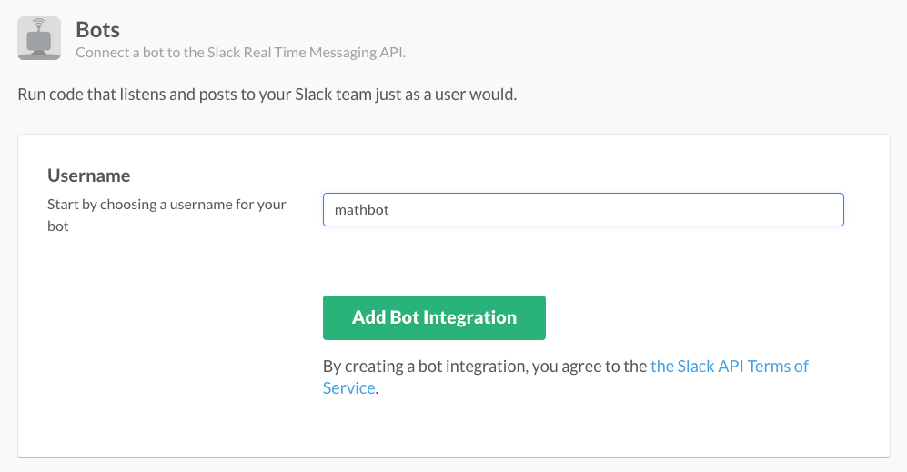

# Contributing to Slack-Ruby-Client

This project is work of [many contributors](https://github.com/slack-ruby/slack-ruby-client/graphs/contributors).

You're encouraged to submit [pull requests](https://github.com/slack-ruby/slack-ruby-client/pulls), [propose features and discuss issues](https://github.com/slack-ruby/slack-ruby-client/issues).

In the examples below, substitute your Github username for `contributor` in URLs.

### Fork the Project

Fork the [project on Github](https://github.com/slack-ruby/slack-ruby-client) and check out your copy.

```
git clone https://github.com/contributor/slack-ruby-client.git
cd slack-ruby-client
git remote add upstream https://github.com/slack-ruby/slack-ruby-client.git
```

### Bundle Install and Test

Ensure that you can build the project and run tests.

```
bundle install
bundle exec rake
```

### Run Examples in Development

Sign up for Slack, create a private slack group for yourself.

Create a new Bot Integration under [services/new/bot](http://slack.com/services/new/bot).



On the next screen, note the API token.

To run [the example in examples/hi_real_time](examples/hi_real_time/hi.rb), open a terminal, cd into _examples/hi_real_time_, run `bundle install`, followed by `SLACK_API_TOKEN=<your API token> bundle exec ruby hi.rb`.

## Contribute Code

### Create a Topic Branch

Make sure your fork is up-to-date and create a topic branch for your feature or bug fix.

```
git checkout master
git pull upstream master
git checkout -b my-feature-branch
```

### Write Tests

Try to write a test that reproduces the problem you're trying to fix or describes a feature that you want to build. Add tests to [spec](spec).

We definitely appreciate pull requests that highlight or reproduce a problem, even without a fix.

### Write Code

Implement your feature or bug fix.

Ruby style is enforced with [Rubocop](https://github.com/bbatsov/rubocop). Run `bundle exec rubocop` and fix any style issues highlighted, auto-correct issues when possible with `bundle exec rubocop -a`. To silence generally ingored issues, including line lengths or code complexity metrics, run `bundle exec rubocop --auto-gen-config`.

Make sure that `bundle exec rake` completes without errors.

### Update Slack Web API

Slack Web API is updated from https://github.com/slack-ruby/slack-api-ref, a maintained, machine-readable version of Slack API Docs, generated by scraping [api.slack.com](https://api.slack.com). To update the Web API from the latest definition run the following Rake task.

```
rake slack:api:update
```

#### Patching Slack Web API

Sometimes it's necessary to patch auto-generated Slack Web API methods. For example, we want to help clients with calling `to_json` on the `attachments` parameter sent to `chat_postMessage`. See [#20](https://github.com/slack-ruby/slack-ruby-client/issues/20).

The broad steps are:
1. Run `rake slack:api:update` to check that existing patches are still valid.
    - If you run into a `failed to apply patch` error, the auto-generated methods likely drifted from the last patch. Follow the steps [below](#resolving-patch-errors).
    - This may add new methods if the API has updated, please split them up into multiple PRs if so.
2. Make a change to a generated file, for example `lib/slack/web/api/endpoints/chat.rb`.
3. Generate a patch:
    ```
    git diff --no-color HEAD lib/slack/web/api/endpoints/chat.rb > lib/slack/web/api/patches/chat.1.patch
    ```
4. Run `rake slack:api:update` to ensure that the patch is cleanly applied. Implement a test for the added or modified functionality and commit the patch file.

##### Resolving Patch Errors

The auto-generated method files may drift overtime e.g. new arguments may be added or descriptions changed. Since previous patches were based on the older auto-generated files, git may be unable to apply them to the new files. Resolving them requires some good ol' splicing:
1. Comment out the patching code in `lib/tasks/web.rake`:
    ```ruby
    # Dir.glob("lib/slack/web/api/patches/#{group}*.patch").sort.each do |patch|
    #   puts "- patching #{patch}"
    #   system("git apply #{patch}") || raise('failed to apply patch')
    # end
    ```
2. Run `rake slack:api:update` to create the raw auto-generated files. Commit the files that you are updating, so we can run `git diff` later.
3. Go through the old patches for the files (e.g. in `lib/slack/web/api/patches/chat.1.patch`), copying code into the new files.
4. Continue with Step 2 [above](#patching-slack-web-api).


### Write Documentation

Document any external behavior in the [README](README.md).

### Update Changelog

Add a line to [CHANGELOG](CHANGELOG.md) under *Next Release*. Don't remove *Your contribution here*.

Make it look like every other line, including a link to the issue being fixed, your name and link to your Github account.

### Commit Changes

Make sure git knows your name and email address:

```
git config --global user.name "Your Name"
git config --global user.email "contributor@example.com"
```

Writing good commit logs is important. A commit log should describe what changed and why.

```
git add ...
git commit
```

### Push

```
git push origin my-feature-branch
```

### Make a Pull Request

Go to https://github.com/contributor/slack-ruby-client and select your feature branch. Click the 'Pull Request' button and fill out the form. Pull requests are usually reviewed within a few days.

### Update CHANGELOG Again

Update the [CHANGELOG](CHANGELOG.md) with the pull request number. A typical entry looks as follows.

```
* [#123](https://github.com/slack-ruby/slack-ruby-client/pull/123): Reticulated splines - [@contributor](https://github.com/contributor).
```

Amend your previous commit and force push the changes.

```
git commit --amend
git push origin my-feature-branch -f
```

### Rebase

If you've been working on a change for a while, rebase with upstream/master.

```
git fetch upstream
git rebase upstream/master
git push origin my-feature-branch -f
```

### Check on Your Pull Request

Go back to your pull request after a few minutes and see whether it passed muster with Travis-CI. Everything should look green, otherwise fix issues and amend your commit as described above.

### Be Patient

It's likely that your change will not be merged and that the nitpicky maintainers will ask you to do more, or fix seemingly benign problems. Hang on there!

## Thank You

Please do know that we really appreciate and value your time and work. We love you, really.
