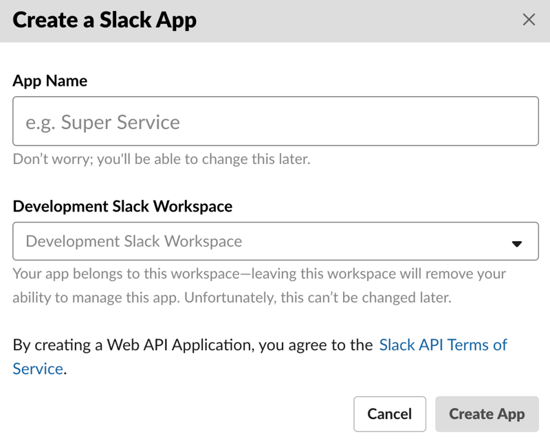
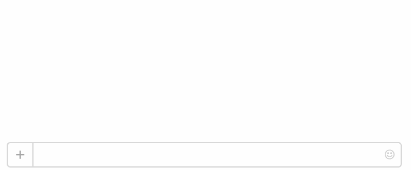

Slack Ruby Client
=================

[](http://badge.fury.io/rb/slack-ruby-client)
[](https://travis-ci.org/slack-ruby/slack-ruby-client)
[](https://codeclimate.com/github/slack-ruby/slack-ruby-client)

A Ruby client for the Slack [Web](https://api.slack.com/web), [RealTime Messaging](https://api.slack.com/rtm) and [Events](https://api.slack.com/events-api) APIs. Comes with a handy command-line client, too. If you are not familiar with these concepts, you might want to watch [this video](http://code.dblock.org/2016/03/11/your-first-slack-bot-service-video.html).


## Table of Contents

- [Useful to Me?](#useful-to-me)
- [Stable Release](#stable-release)
- [Installation](#installation)
- [Usage](#usage)
  - [Create a New Bot Integration](#create-a-new-bot-integration)
  - [OAuth Code Grant](#oauth-code-grant)
  - [Using the Legacy API Token](#using-the-legacy-api-token)
  - [Global Settings](#global-settings)
  - [Web Client](#web-client)
    - [Web Client Examples](#web-client-examples)
      - [Test Auth](#test-auth)
      - [Send Messages](#send-messages)
      - [List Channels](#list-channels)
      - [Upload a File](#upload-a-file)
      - [Get Channel Info](#get-channel-info)
      - [Get User Info](#get-user-info)
      - [Search for a User](#search-for-a-user)
      - [Other](#other)
    - [Web Client Options](#web-client-options)
    - [Pagination Support](#pagination-support)
    - [Character Encoding](#character-encoding)
    - [Error Handling](#error-handling)
      - [Slack Errors](#slack-errors)
      - [Rate Limiting](#rate-limiting)
      - [Other Errors](#other-errors)
  - [RealTime Client](#realtime-client)
    - [Slack::RealTime::Stores::Store](#slackrealtimestoresstore)
    - [Slack::RealTime::Stores::Starter](#slackrealtimestoresstarter)
  - [Configuring Slack::RealTime::Client](#configuring-slackrealtimeclient)
    - [Caveats](#caveats)
      - [websocket_ping](#websocket_ping)
  - [Connection Methods](#connection-methods)
  - [Combining RealTime and Web Clients](#combining-realtime-and-web-clients)
  - [Large Team Considerations](#large-team-considerations)
    - [Concurrency](#concurrency)
      - [Async](#async)
      - [Faye::Websocket with Eventmachine](#fayewebsocket-with-eventmachine)
      - [Celluloid](#celluloid)
  - [Events API](#events-api)
    - [Configuring Slack::Events](#configuring-slackevents)
    - [Verifying the Request Signature](#verifying-the-request-signature)
  - [Message Parsing](#message-parsing)
  - [Command-Line Client](#command-line-client)
    - [Authenticate with Slack](#authenticate-with-slack)
    - [Send a Message](#send-a-message)
    - [Get Channel Id](#get-channel-id)
    - [Get Channel Info](#get-channel-info-1)
    - [List Users](#list-users)
- [History](#history)
- [Contributing](#contributing)
- [Copyright and License](#copyright-and-license)

## Useful to Me?

* This library will let you send messages to Slack via the Web API, send and receive messages via the Real Time Messaging API and facilitate integration with the Events API.
* To respond to slash commands, interactive components or events, implement a web application using your favorite web framework and use this library to call the Slack Web API and to verify that events are coming from Slack.
* To build a bot using the Real Time Messaging API, use [slack-ruby-bot](https://github.com/slack-ruby/slack-ruby-bot), which uses this library.
* To roll out a complete service using the Real Time Messaging API with Slack button integration to multiple teams, check out [slack-ruby-bot-server](https://github.com/slack-ruby/slack-ruby-bot-server), which is built on top of slack-ruby-bot, which uses this library.

## Stable Release

You're reading the documentation for the **stable** release of slack-ruby-client, v0.15.1. See [UPGRADING](UPGRADING.md) when upgrading from an older version.

## Installation

Add to Gemfile.

```
gem 'slack-ruby-client'
```

If you're going to be using the RealTime client, add either `async-websocket`, `eventmachine` and `faye-websocket` or `celluloid-io`. See below for more information about concurrency. We recommend you use `async-websocket`.

```
gem 'async-websocket', '~> 0.8.0'
```

Run `bundle install`.

## Usage

### Create a New Bot Integration

To integrate your bot with Slack, you must first create a new [Slack App](https://api.slack.com/apps).



### OAuth Code Grant

Once created, go to the app's Basic Info tab and grab the Client ID and Client Secret.  You'll need these in order complete an [OAuth code grant flow](https://api.slack.com/docs/oauth#flow) as described at [slack-ruby-bot-server](https://github.com/slack-ruby/slack-ruby-bot-server).

### Using the Legacy API Token

Although OAuth is recommended, you can still [generate a legacy API token](https://api.slack.com/custom-integrations/legacy-tokens) for your app and use it for some interactions.

```ruby
Slack.configure do |config|
  config.token = ENV['SLACK_API_TOKEN']
end
```

This sets a global default token. You can also pass a token into the initializer of both `Slack::Web::Client` and `Slack::RealTime::Client` or configure those separately via `Slack::Web::Config.configure` and `Slack::RealTime::Config.configure`. The instance token will be used over the client type token over the global default.

### Global Settings

The following global settings are supported via `Slack.configure`.

setting      | description
-------------|-------------------------------------------------------------------------------------------------
token        | Slack API token.
logger       | An optional logger, defaults to `::Logger.new(STDOUT)` at `Logger::WARN` level.

### Web Client

The Slack Web API allows you to build applications that interact with Slack.

#### Web Client Examples

Here are some examples of how to use the web client with the Web API.

##### Test Auth

```ruby
client = Slack::Web::Client.new
client.auth_test
```

##### Send Messages

Send messages with [chat_PostMessage](https://api.slack.com/methods/chat.postMessage).

```ruby
client.chat_postMessage(channel: '#general', text: 'Hello World', as_user: true)
```

See a fully working example in [examples/hi_web](examples/hi_web/hi.rb).


##### List Channels

List channels with [channels_list](https://api.slack.com/methods/channels.list).

```ruby
channels = client.channels_list.channels

general_channel = channels.detect { |c| c.name == 'general' }
```

##### Upload a File

Upload a file with [files_upload](https://api.slack.com/methods/files.upload).

```ruby
client.files_upload(
  channels: '#general',
  as_user: true,
  file: Faraday::UploadIO.new('/path/to/avatar.jpg', 'image/jpeg'),
  title: 'My Avatar',
  filename: 'avatar.jpg',
  initial_comment: 'Attached a selfie.'
)
```

##### Get Channel Info

You can use a channel ID or name (prefixed with `#`) in all functions that take a `:channel` argument. Lookup by name is not supported by the Slack API and the `channels_id` method called invokes `channels_list` in order to locate the channel ID.

```ruby
client.channels_info(channel: 'C04KB5X4D') # calls channels_info
```

```ruby
client.channels_info(channel: '#general') # calls channels_list followed by channels_info
```

##### Get User Info

You can use a user ID or name (prefixed with `@`) in all functions that take a `:user` argument. Lookup by name is not supported by the Slack API and the `users_id` method called invokes `users_list` in order to locate the user ID.

```ruby
client.users_info(user: 'U092BDCLV') # calls users_info
```

```ruby
client.users_info(user: '@dblock') # calls users_list followed by users_info
```

##### Search for a User

Constructs an in-memory index of users and searches it. If you want to use this functionality, add the [picky](https://github.com/floere/picky) gem to your project's Gemfile.

```ruby
client.users_search(user: 'dblock')
```

##### Other

Refer to the [Slack Web API Method Reference](https://api.slack.com/methods) for the list of all available functions.

#### Web Client Options

You can configure the Web client either globally or via the initializer.

```ruby
Slack::Web::Client.configure do |config|
  config.user_agent = 'Slack Ruby Client/1.0'
end
```

```ruby
client = Slack::Web::Client.new(user_agent: 'Slack Ruby Client/1.0')
```

The following settings are supported.

setting             | description
--------------------|-------------------------------------------------------------------------------------------------
token               | Slack API token.
user_agent          | User-agent, defaults to _Slack Ruby Client/version_.
proxy               | Optional HTTP proxy.
ca_path             | Optional SSL certificates path.
ca_file             | Optional SSL certificates file.
endpoint            | Slack endpoint, default is _https://slack.com/api_.
logger              | Optional `Logger` instance that logs HTTP requests.
timeout             | Optional open/read timeout in seconds.
open_timeout        | Optional connection open timeout in seconds.
default_page_size   | Optional page size for paginated requests, default is _100_.
default_max_retries | Optional number of retries for paginated requests, default is _100_.
adapter             | Optional HTTP adapter to use, defaults to `Faraday.default_adapter`.

You can also pass request options, including `timeout` and `open_timeout` into individual calls.

```ruby
client.channels_list(request: { timeout: 180 })
```

You can also control what proxy options are used by modifying the `http_proxy` environment variable per [Net::HTTP's documentation](https://docs.ruby-lang.org/en/2.0.0/Net/HTTP.html#class-Net::HTTP-label-Proxies).

Note that Docker on OSX seems to incorrectly set the proxy, causing `Faraday::ConnectionFailed, ERROR -- : Failed to open TCP connection to : (getaddrinfo: Name or service not known)`. You might need to manually unset `http_proxy` in that case, eg. `http_proxy="" bundle exec ruby ./my_bot.rb`.

#### Pagination Support

The Web client natively supports [cursor pagination](https://api.slack.com/docs/pagination#cursors) for methods that allow it, such as `users_list`. Supply a block and the client will make repeated requests adjusting the value of `cursor` with every response. The default limit is set to 100 and can be adjusted via `Slack::Web::Client.config.default_page_size` or by passing it directly into the API call.

```ruby
all_members = []
client.users_list(presence: true, limit: 10) do |response|
  all_members.concat(response.members)
end
all_members # many thousands of team members retrieved 10 at a time
```

When using cursor pagination the client will automatically pause and then retry the request if it runs into Slack rate limiting. (It will pause according to the `Retry-After` header in the 429 response before retrying the request.) If it receives too many rate-limited responses in a row it will give up and raise an error. The default number of retries is 100 and can be adjusted via `Slack::Web::Client.config.default_max_retries` or by passing it directly into the method as `max_retries`.

You can also proactively avoid rate limiting by adding a pause between every paginated request with the `sleep_interval` parameter, which is given in seconds.

```ruby
all_members = []
client.users_list(presence: true, limit: 10, sleep_interval: 5, max_retries: 20) do |response|
  # pauses for 5 seconds between each request
  # gives up after 20 consecutive rate-limited responses
  all_members.concat(response.members)
end
all_members # many thousands of team members retrieved 10 at a time
```

#### Character Encoding

Note that Slack expects `text` to be UTF-8 encoded. If your messages appear with text such as `BAD+11` in Slack, check `text.encoding` and `.encode(Encoding::UTF_8)` your messages before sending them to Slack.

```ruby
text = 'characters such as "Ñ", "Á", "É"'
text.encoding
=> #<Encoding:UTF-8>
client.chat_postMessage(channel: '#general', text: text, as_user: true)
# renders 'characters such as "Ñ", "Á", "É"' in Slack

text = text.encode(Encoding::ISO_8859_1)
text.encoding
# => #<Encoding:ISO-8859-1>
client.chat_postMessage(channel: '#general', text: text, as_user: true)
# renders 'characters such as "BAD+11", "", "BAD+9"' in Slack
```

#### Error Handling

##### Slack Errors

If Slack returns an error for the request, then an error will be raised. The error class is specific to the type of error that Slack returns. For instance if Slack returns `account_inactive` then the error will be `Slack::Web::Api::Errors::AccountInactive`. This allows you to handle certain types of errors as needed:

```ruby
rescue Slack::Web::Api::Errors::AccountInactive => e
  # deal with inactive account
end
```

All of these errors inherit from `Slack::Web::Api::Errors::SlackError`, so you can handle or silence all errors if necessary:

```ruby
rescue Slack::Web::Api::Errors::SlackError => e
  # capture all Slack errors
end
```

If there's a new error type that is not yet known by this library, then it will raise `Slack::Web::Api::Errors::SlackError`. (Update the Web API if you find that errors are missing — see [CONTRIBUTING](CONTRIBUTING.md).)

In all of these cases the error message contains the error code, which is also accessible with `slack_error.error`. In case of multiple errors, the error message contains the error codes separated by commas, or they are accessible as an array with `slack_error.errors`. The original response is also accessible using the `response` attribute. The `response_metadata` is accessible with `slack_error.response_metadata`.

##### Rate Limiting

If you exceed [Slack’s rate limits](https://api.slack.com/docs/rate-limits), a `Slack::Web::Api::Errors::TooManyRequestsError` will be raised instead. (This does not inherit from `Slack::Web::Api::Errors::SlackError`.)

##### Other Errors

In any other case, a `Faraday::ClientError` will be raised. This may be the case if Slack is temporarily unavailable, for example.

### RealTime Client

The Real Time Messaging API is a WebSocket-based API that allows you to receive events from Slack in real time and send messages as user.

```ruby
client = Slack::RealTime::Client.new

client.on :hello do
  puts "Successfully connected, welcome '#{client.self.name}' to the '#{client.team.name}' team at https://#{client.team.domain}.slack.com."
end

client.on :message do |data|
  case data.text
  when 'bot hi' then
    client.message(channel: data.channel, text: "Hi <@#{data.user}>!")
  when /^bot/ then
    client.message(channel: data.channel, text: "Sorry <@#{data.user}>, what?")
  end
end

client.on :close do |_data|
  puts "Client is about to disconnect"
end

client.on :closed do |_data|
  puts "Client has disconnected successfully!"
end

client.start!
```

You can send typing indicators with `typing`.

```ruby
client.typing channel: data.channel
```

You can send a ping with `ping`.

```ruby
client.ping
```

By default, the RealTime client exposes and maintains a local store with the properties of [rtm.start](https://api.slack.com/methods/rtm.start) upon a successful connection.

property | description
---------|-------------------------------------------------------------------------------------------------
url      | A WebSocket Message Server URL.
self     | The authenticated bot user.
team     | Details on the authenticated user's team.
users    | A hash of user objects by user ID.
channels | A hash of channel objects, one for every channel visible to the authenticated user.
groups   | A hash of group objects, one for every group the authenticated user is in.
ims      | A hash of IM objects, one for every direct message channel visible to the authenticated user.
bots     | Details of the integrations set up on this team.

It also tracks changes, such as users being renamed, added or deleted, therefore `client.users` is always up-to-date.

Tracking with a local store can be disabled with `Slack::RealTime::Client.new(store_class: nil)`. Other stores are also available.

#### Slack::RealTime::Stores::Store

The default store that tracks all changes. By default the client will be connected using `rtm_start`.

#### Slack::RealTime::Stores::Starter

A smaller store that only stores and tracks information about the bot user, but not channels, users, groups, ims or bots. By default the client will be connected using `rtm_connect`.

### Configuring Slack::RealTime::Client

You can configure the RealTime client either globally or via the initializer.

```ruby
Slack::RealTime::Client.configure do |config|
  config.websocket_ping = 42
end
```

```ruby
client = Slack::RealTime::Client.new(websocket_ping: 42)
```

The following settings are supported.

setting         | description
----------------|-----------------------------------------------------------------------------------------------------
token           | Slack API token.
websocket_ping  | How long the socket can be idle before sending a ping message to confirm it's still connected, default is 30.
websocket_proxy | Connect via proxy, include `:origin` and `:headers`.
store_class     | Local store class name, default is an in-memory `Slack::RealTime::Stores::Store`.
start_method    | Optional start method, either `:rtm_start` or `:rtm_connect`.
start_options   | Options to pass into `rtm.start` or `rtm.connect`, default is `{ request: { timeout: 180 } }`.
logger          | Optional `Logger` instance that logs RealTime requests and socket data.

Note that the RealTime client uses a Web client to obtain the WebSocket URL via [rtm.start](https://api.slack.com/methods/rtm.start) or [rtm.connect](https://api.slack.com/methods/rtm.connect). While `token` and `logger` options are passed down from the RealTime client, you may also configure Web client options via `Slack::Web::Client.configure` as described above.

See a fully working example in [examples/hi_real_time](examples/hi_real_time/hi.rb).



#### Caveats

##### `websocket_ping`
This setting determines how long the socket can be idle before sending a ping message to confirm it's still connected.

It's important to note that if a ping message was sent and no response was received within the amount of time specified in `websocket_ping` the client will attempt to reestablish it's connection to the message server.

Note that the ping may take between `websocket_ping` and `websocket_ping * 3/2` seconds to actually trigger when there is no activity on the socket. This is because the timer that checks whether to ping is triggered at every `websocket_ping / 2` interval.

To disable this feature set `websocket_ping` to 0.

### Connection Methods

The RealTime client uses either [rtm.start](https://api.slack.com/methods/rtm.start) or [rtm.connect](https://api.slack.com/methods/rtm.connect) to open a connection. The former retrieves a lot of team information while the latter only serves connection purposes and is preferred. You should let the library choose the right method for you based on the `store_class` used and override this behavior with `start_method` when necessary.

```ruby
Slack::RealTime::Client.configure do |config|
  config.start_method = :rtm_start
end
```

### Combining RealTime and Web Clients

Since the Web client is used to obtain the RealTime client's WebSocket URL, you can continue using the Web client in combination with the RealTime client.

```ruby
client = Slack::RealTime::Client.new

client.on :message do |data|
  case data.text
  when 'bot hi' then
    client.web_client.chat_postMessage(channel: data.channel, text: "Hi <@#{data.user}>!")
  when /^bot/ then
    client.web_client.chat_postMessage(channel: data.channel, text: "Sorry <@#{data.user}>, what?")
  end
end

client.start!
```

See a fully working example in [examples/hi_real_time_and_web](examples/hi_real_time_and_web/hi.rb).


### Large Team Considerations

The `rtm.start` call downloads a large amount of data. For large teams, consider reducing the amount of unnecessary data downloaded with `start_options`. You may also want to increase the default timeout of 180 seconds.

```ruby
Slack::RealTime::Client.configure do |config|
  # Return timestamp only for latest message object of each channel.
  config.start_options[:simple_latest] = true
  # Skip unread counts for each channel.
  config.start_options[:no_unreads] = true
  # Increase request timeout to 6 minutes.
  config.start_options[:request][:timeout] = 360
end
```

See [#134](https://github.com/slack-ruby/slack-ruby-client/issues/134) for a discussion on this topic.

#### Concurrency

`Slack::RealTime::Client` needs help from a concurrency library and supports [Async](https://github.com/socketry/async), [Faye::WebSocket](https://github.com/faye/faye-websocket-ruby) with [Eventmachine](https://github.com/eventmachine/eventmachine) and [Celluloid](https://github.com/celluloid/celluloid). It will auto-detect one or the other depending on the gems in your Gemfile, but you can also set concurrency explicitly.

```ruby
Slack::RealTime.configure do |config|
  config.concurrency = Slack::RealTime::Concurrency::Async
end
```

Use `client.start_async` instead of `client.start!`. A good example of such application is [slack-ruby-bot-server](https://github.com/slack-ruby/slack-ruby-bot-server).

```ruby
client = Slack::RealTime::Client.new

client.start_async
```

##### Async

This is the recommended library. Add `async-websocket` to your Gemfile.

```
gem 'async-websocket'
```

See a fully working example in [examples/hi_real_time_async_async](examples/hi_real_time_async_async/hi.rb).

##### Faye::Websocket with Eventmachine

Add the following to your Gemfile.

```
gem 'faye-websocket'
```

See a fully working example in [examples/hi_real_time_async_eventmachine](examples/hi_real_time_async_eventmachine/hi.rb).

##### Celluloid

Add the following to your Gemfile.

```
gem 'celluloid-io', require: ['celluloid/current', 'celluloid/io']
```

See a fully working example in [examples/hi_real_time_async_celluloid](examples/hi_real_time_async_celluloid/hi.rb).

### Events API

This library provides limited support for the [Slack Events API](https://api.slack.com/events-api).

#### Configuring Slack::Events

You can configure Events support globally.

```ruby
Slack::Events.configure do |config|
  config.signing_secret = 'secret'
end
```

The following settings are supported.

setting               | description
----------------------|---------------------------------------------------------------------------------------------------
signing_secret        | Slack signing secret, defaults is `ENV['SLACK_SIGNING_SECRET']`.
signature_expires_in  | Signature expiration window in seconds, default is `300`.

#### Verifying the Request Signature

Slack signs its requests using a secret that's unique to your app. Verify incoming HTTP requests as follows.

```ruby
slack_request = Slack::Events::Request.new(http_request)
slack_request.verify!
```

To specify secrets on a per-request basis:
```ruby
Slack::Events::Request.new(http_request,
                           signing_secret: signing_secret,
                           signature_expires_in: signature_expires_in)
```

The `verify!` call may raise `Slack::Events::Request::MissingSigningSecret`, `Slack::Events::Request::InvalidSignature` or `Slack::Events::Request::TimestampExpired` errors.

### Message Parsing

All text in Slack uses the same [system of escaping](https://api.slack.com/docs/formatting): chat messages, direct messages, file comments, etc. Use [Slack::Messages::Formatting](lib/slack/messages/formatting.rb) to unescape incoming messages. This comes handy, for example, you want to treat all input to a real time bot as plain text.

```ruby
Slack::Messages::Formatting.unescape('Hello &amp; &lt;world&gt;'))
  # => 'Hello & <world>'
Slack::Messages::Formatting.unescape('Hey <@U024BE7LH|bob>, did you see my file?'))
  # => 'Hey @bob, did you see my file?'
Slack::Messages::Formatting.unescape('Hey <@U02BEFY4U>'))
  # => 'Hey @U02BEFY4U'
Slack::Messages::Formatting.unescape('This message contains a URL <http://foo.com/>'))
  # => 'This message contains a URL http://foo.com/'
Slack::Messages::Formatting.unescape('So does this one: <http://www.foo.com|www.foo.com>'))
  # => 'So does this one: www.foo.com'
Slack::Messages::Formatting.unescape('<mailto:bob@example.com|Bob>'))
  # => 'Bob'
Slack::Messages::Formatting.unescape('Hello <@U123|bob>, say hi to <!everyone> in <#C1234|general>'))
  # => 'Hello @bob, say hi to @everyone in #general'
Slack::Messages::Formatting.unescape('Hello <@U123|bob> &gt; file.txt'))
  # => 'Hello @bob > file.txt'
Slack::Messages::Formatting.unescape('“hello”'))
  # => '"hello"'
Slack::Messages::Formatting.unescape('‘hello’'))
  # => "'hello'"
```

### Command-Line Client

The slack command-line client returns JSON data from the Slack API.

#### Authenticate with Slack

```
$ slack --slack-api-token=[token] auth test
{"ok":true,"url":"...","team":"...","user":"...","team_id":"...","user_id":"..."}
```

#### Send a Message

```
export SLACK_API_TOKEN=...
$ slack chat postMessage --text="hello world" --channel="#general"
{"ok":true,"channel":"...","ts":"...","message":{"text":"hello world","username":"bot","type":"message","subtype":"bot_message","ts":"..."}}
```

#### Get Channel Id

```
$ slack channels id --channel=#general
{"ok":true,"channel":{"id":"C04KB5X4D"}}
```

#### Get Channel Info

```
$ slack channels info --channel=#general
{"ok":true,"channel":{"id":"C04KB5X4D","name":"general", ...}}
```

#### List Users

Combine with [jq](http://stedolan.github.io/jq), a command-line JSON parser.

```
$ slack users list | jq '.members | map({(.id): .name})'
[
  {
    "U04KB5WQR": "dblock"
  },
  {
    "U07518DTL": "rubybot"
  }
]
```

See `slack help` for a complete command-line reference.

## History

This gem is based on [slack-ruby-gem](https://github.com/aki017/slack-ruby-gem), but it more clearly separates the Web and RTM APIs, is more thoroughly tested and is in active development.

## Contributing

See [CONTRIBUTING](CONTRIBUTING.md).

## Copyright and License

Copyright (c) 2015-2019, [Daniel Doubrovkine](https://twitter.com/dblockdotorg), [Artsy](https://www.artsy.net) and [Contributors](CHANGELOG.md).

This project is licensed under the [MIT License](LICENSE.md).
